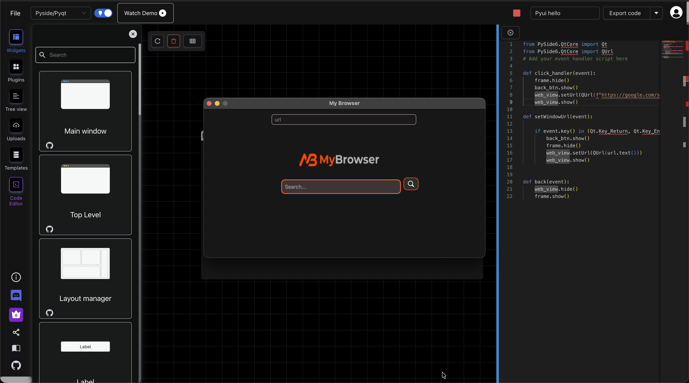
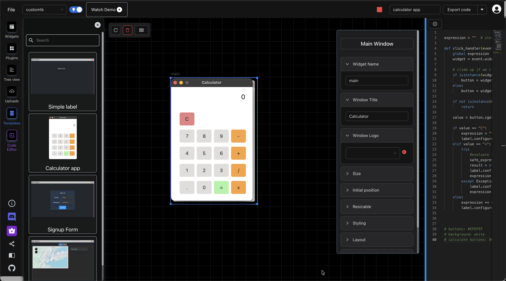
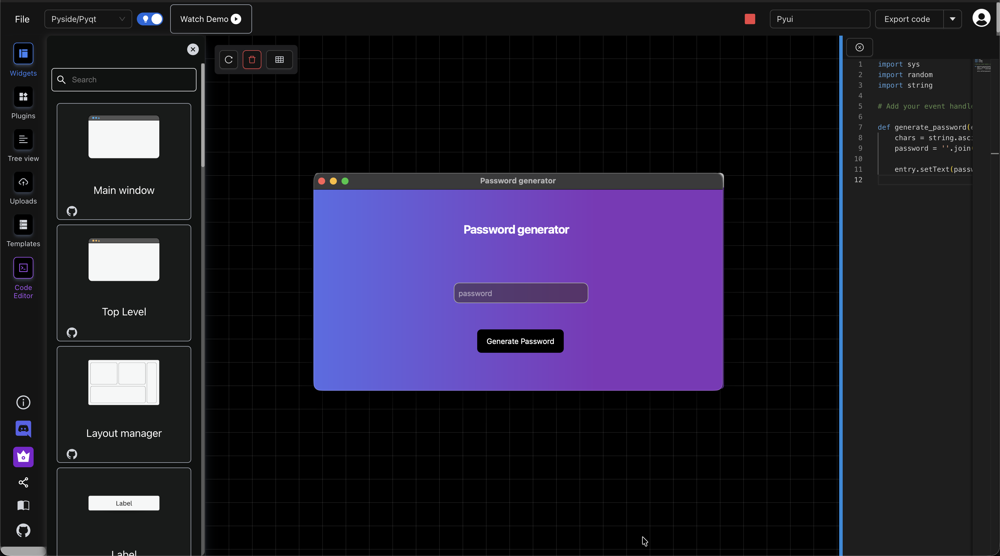
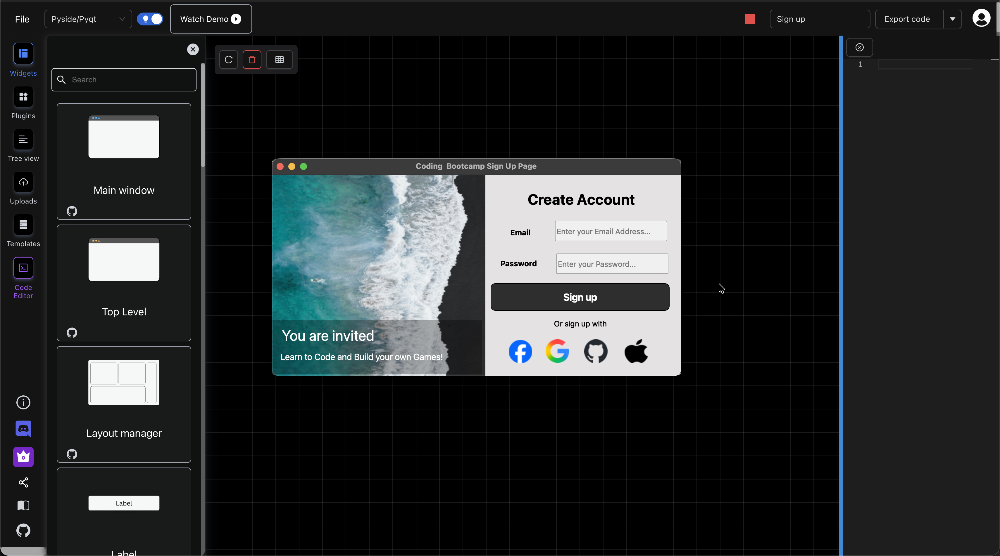

# Pyuibuilder-examples
Examples of Pyuibuilder GUIs

### How to use 
Go to the examples folder and download the .pyui file -> open pyuibuilder -> Load the file

## 1. Browser

Create a simple browser using drag and drop and Pyuibuilder (Uses Pyside)

[Link to browser pyui file](./examples/browser/)

## 2. Calculator

Create calculator app using Customtk and Pyuibuilder

[Link to calculator pyui file](./examples/calculator/)

## 3. Password generator

Create password generator app using Pyside and Pyuibuilder

[Link to calculator pyui file](./examples/password-generator/)

## 4. Signup

Create signup using Pyside and Pyuibuilder

[Link to calculator pyui file](./examples/password-generator/)
